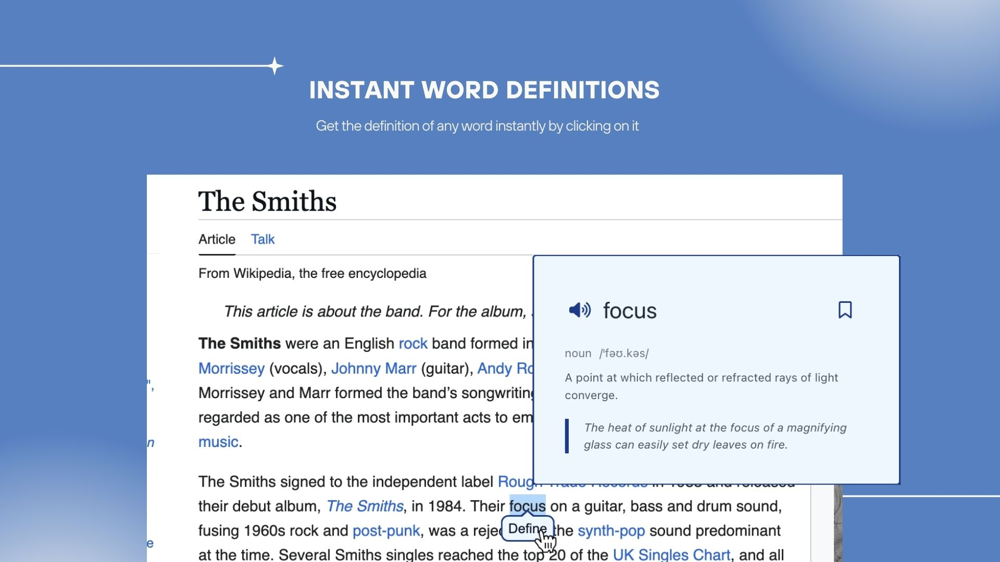
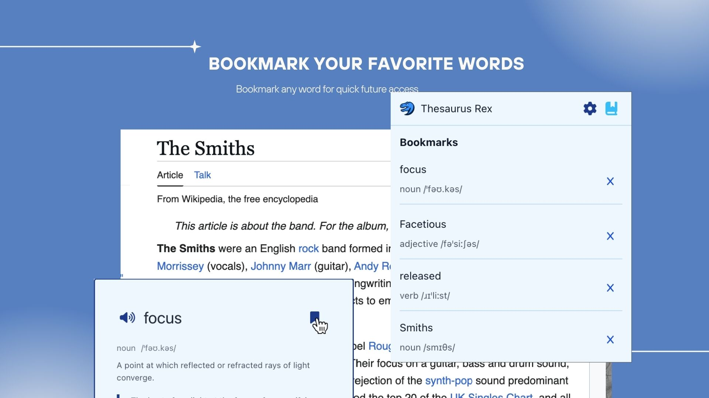
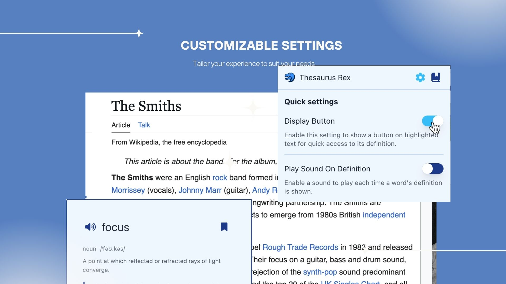

# Thesaurus Rex - Chrome Extension

**Thesaurus Rex** is a powerful and user-friendly Chrome extension designed to help you quickly access word definitions, use cases, and more. With its intuitive popup interface, you can effortlessly look up words and manage bookmarks for your favorite entries.

---

## **Installation**

You can easily install **Thesaurus Rex** from the Chrome Web Store:

1. Visit the [Chrome Web Store page](https://chrome.google.com/webstore/detail/thesaurus-rex) (Link to be added once published).
2. Click **Add to Chrome**.
3. Once installed, the Thesaurus Rex icon will appear in your browser toolbar. Click on it to begin using the extension.

---

## **Features**

- **Word Definition Lookup**: Quickly find the meaning, part of speech, and pronunciation of any word you highlight on a webpage.
- **Synonym Suggestions**: Get a list of synonyms for your selected word to enhance your vocabulary.
- **Bookmark Your Favorite Words**: Save words you want to revisit later in your bookmarks section.
- **Sound on Definition**: Optionally, enable a sound effect that plays whenever a word's definition is displayed for better engagement.

---

## **How It Works**

1. **Highlight a word**: Simply highlight any word on a webpage to activate the extension.
2. **View Definition**: After highlighting the word, click the Thesaurus Rex icon in the browser toolbar to see the definition, synonyms, and other details.
3. **Bookmark Words**: You can easily bookmark words for quick future reference, storing them within the extension.
4. **Customize Your Settings**: Access the settings to toggle options like display button visibility and sound effects.

---

## **Implementation Details**

**Thesaurus Rex** was built with modern web technologies to ensure speed, reliability, and a smooth user experience:

### **Technologies Used**

- **React**: The popup interface and modal window are built with React, ensuring a dynamic and responsive user interface.
- **Vite**: For fast development and quick hot-reloading during the development process, I used Vite to bundle and optimize the code.
- **Chrome Extension APIs**: The extension leverages various Chrome APIs to store user data (bookmarks) locally and interact with the browser.
- **Word API Integration**: I integrated a powerful external API to fetch word definitions, phonetics, and synonyms. This API enables the extension to pull real-time word data and display it instantly when a user queries a word.
- **CSS Transitions**: To enhance the UI, smooth transitions and animations are applied when the user interacts with the popup, making for a polished, seamless experience.

### **React & Popup Modal**

The extension’s popup modal is built with **React** to dynamically display the word definitions and manage the user interface:

- **React State Management**: React hooks like `useState` and `useEffect` manage the app’s state, including user settings and bookmarks.
- **Conditional Rendering**: The extension intelligently switches between different screens (Settings and Bookmarks) using conditional rendering.
- **CSSTransition**: React Transition Group is used for smooth transitions and animations when adding or removing bookmarks.

### **Bookmarks**

- **Chrome Storage API**: Bookmarks are stored locally using the `chrome.storage.local` API. This allows bookmarks to persist between sessions without needing an external database.
- **Bookmark UI**: Bookmarks are displayed in the modal and can be removed easily by clicking the 'X' button next to each word.
  
### **API for Word Data**

The extension fetches word definitions, synonyms, and phonetic data from a reliable word API. The response from the API is parsed and displayed within the popup in an organized manner. Here’s a brief breakdown of how the API is used:

1. **Word Lookup**: The word selected by the user is sent to the API, which returns a JSON response containing:
   - Definition(s)
   - Part of speech (noun, verb, etc.)
   - Phonetic pronunciation (IPA or audio)
   - Synonyms
   
2. **Error Handling**: In case the API doesn’t return a result (e.g., for rare or slang words), a fallback message is displayed, notifying the user that no information could be retrieved.

### **Popup UI**

The popup UI is designed to be minimalistic yet informative, showing:
- The word and its definition(s).
- Phonetic transcription and audio (if available).
- A list of synonyms to help the user broaden their vocabulary.
  
### **Customization Options**

In the **Settings** screen of the extension, users can toggle:
- **Display Button**: Show or hide the quick-access button that appears when the user highlights a word.
- **Play Sound on Definition**: Toggle an audio cue that plays whenever a word’s definition is displayed, enhancing the experience.

---

## **Future Updates**

- **Synonym Suggestions**: Plan to implement more advanced synonym filtering based on context.
- **Improved UI/UX**: Further improvements to make the extension even more intuitive, such as adding a history feature to revisit past lookups.
- **Expanded Word Database**: Integrating additional word sources for more comprehensive definitions and examples.

---

## **Contributing**

If you would like to contribute to **Thesaurus Rex**, feel free to fork the repository and create a pull request with your suggested improvements. Any contributions to improve functionality, UI/UX, or performance are welcome!

---

## **License**

This project is licensed under the Apache License - see the [LICENSE](LICENSE) file for details.
